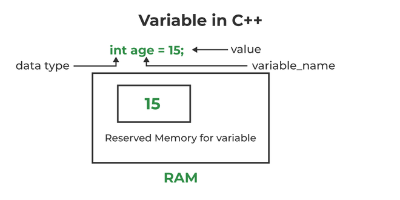

# Cơ bản về ngôn ngữ lập trình C++
## Introduction

C++ là một ngôn ngữ lập trình đa năng được phát triển như là một sự mở rộng của ngôn ngữ C để bao gồm mô hình hướng đối tượng. Đây là một ngôn ngữ lập trình cấp cao và được biên dịch.

Ví dụ:
```cpp
#include <iostream>
 
int main() {
    std::cout << "Hello, World!" << std::endl;
    return 0;
}   
```

### Hoạt động


## Basic 
### Libraries
```cpp
#include <iostream>
#include <sstream>
#include <fstream>
#include <vector>
#include <string>
#include <algorithm>
int main() {
    return 0;
}   
```

Thư viện chứa tất cả thư viện tiêu chuẩn.
```cpp
#include <bits/stdc++.h>
```

Thư viện tự soạn
```cpp
#include "myLib.h"
```
### Namespace

Trong C++, `namespace` là một tập hợp các tên hoặc định danh liên quan (hàm, lớp, biến) giúp phân biệt những định danh này với những định danh tương tự trong các `namespace` khác hoặc trong global `namespace`.

Các định danh của thư viện chuẩn C++ được định nghĩa trong một `namespace` được gọi là `std`.

Để sử dụng bất kỳ định danh nào thuộc thư viện chuẩn, chúng ta cần chỉ định rằng nó thuộc về `namespace std`. Một cách để làm điều này là sử dụng toán tử giải phóng phạm vi `::`. Ví dụ:
```cpp
std::cout << "Hello World!";
```
Ở đây, chúng ta đã sử dụng mã `std::` trước cout. Điều này thông báo cho trình biên dịch C++ rằng đối tượng `cout` mà chúng ta đang sử dụng thuộc về `namespace std`.


Tất cả các định danh của thư viện chuẩn được cung cấp bởi các tệp tiêu đề chuẩn như `<iostream>`, `<string>`, `<vector>`, v.v. đều được khai báo trong namespace std.

Ví dụ, các định danh cin và cout được định nghĩa trong tệp tiêu đề chuẩn `<iostream>` thuộc `namespace std`.

Chúng ta có thể sử dụng các định danh thuộc namespace std trong chương trình của mình bằng cách sử dụng:

1. Toán tử `::` (phạm vi giải phóng):
Sử dụng toán tử `::` để chỉ định rằng một định danh thuộc về namespace std.

Ví dụ: `std::cout` hoặc `std::cin`.
```cpp
#include <iostream>

int main() {
    std::cout << "Hello, World!" << std::endl;
    return 0;
}
```
2. Khai báo sử dụng (using declaration):
Sử dụng khai báo sử dụng để chỉ định rằng chúng ta muốn sử dụng một định danh cụ thể từ namespace std trong phạm vi hiện tại.

Ví dụ: `using std::cout`; hoặc `using std::cin`;.
```cpp
#include <iostream>

int main() {
    using std::cout;
    using std::endl;

    cout << "Hello, World!" << endl;
    return 0;
}
```
3. Chỉ thị sử dụng (using directive):
Sử dụng chỉ thị sử dụng để bao gồm toàn bộ namespace std trong phạm vi hiện tại, giúp chúng ta tránh việc phải sử dụng `std::` mỗi lần.

Ví dụ: `using namespace std;`.
```cpp
#include <iostream>

int main() {
    using namespace std;

    cout << "Hello, World!" << endl;
    return 0;
}
```

Lưu ý rằng việc sử dụng chỉ thị sử dụng có thể dẫn đến xung đột tên trong trường hợp lớn và không được khuyến khích trong các tệp đầu vào lớn hoặc trong mã nguồn mở để tránh xung đột đặt tên không mong muốn.

### Variables


#### Kiểu nguyên
| Kiểu            | Kích thước | Vùng giá trị                                        |
|-----------------|-------------|-----------------------------------------------------|
| char            | 1 byte      | -128 đến 127 hoặc 0 đến 255                         |
| unsigned char   | 1 byte      | 0 đến 255                                           |
| signed char     | 1 byte      | -128 đến 127                                        |
| int             | 2 hoặc 4 bytes | -32,768 đến 32,767 hoặc -2,147,483,648 đến 2,147,483,647 |
| unsigned int    | 2 hoặc 4 bytes | 0 đến 65,535 hoặc 0 đến 4,294,967,295                |
| short           | 2 bytes     | -32,768 đến 32,767                                  |
| unsigned short  | 2 bytes     | 0 đến 65,535                                        |
| long            | 4 bytes     | -2,147,483,648 đến 2,147,483,647                     |
| unsigned long   | 4 bytes     | 0 đến 4,294,967,295                                  |


#### Kiểu thực
| Kiểu          | Kích thước | Vùng giá trị                         | Độ chính xác         |
|---------------|-------------|--------------------------------------|----------------------|
| float         | 4 bytes     | 1.2E-38 đến 3.4E+38                 | 6 vị trí thập phân   |
| double        | 8 bytes     | 2.3E-308 đến 1.7E+308                | 15 vị trí thập phân  |
| long double   | 10 bytes    | 3.4E-4932 đến 1.1E+4932              | 19 vị trí thập phân |

#### Một số kiểu khác
| Kiểu          | Kích thước|
|---------------|-------------|
| char        | 1 bytes     | 
| bool        | 1 bytes     |
| void  |   |

#### auto
```cpp
auto a = 1; // a will become 'int' 
auto b = 1LL; // b will become 'long long' 
auto c = 1.0; // c will become 'double' 
auto d = "variable"; // d will become 'string' 
```

#### string


C Style string được lưu trữ dưới dạng mảng thông thường của các ký tự, kết thúc bởi ký tự null `'0'`. Chúng là loại chuỗi mà C++ thừa hưởng từ ngôn ngữ C.

C++ Style string là các loại chuỗi mới được giới thiệu trong C++ dưới dạng lớp `std::string` được định nghĩa trong tệp tiêu đề `<string>`. Điều này mang lại nhiều lợi ích so với chuỗi kiểu C truyền thống như kích thước động, các hàm thành viên, và nhiều tính năng khác.
#### Biến toàn cục (global variable)
```cpp
#include <bits/stdc++.h>
using namespace std;

int a = 1; // global variable

void f(){
    a++;
}

void g(){
    a+=2;
}

int main(){
    f();
    g();
    cout << a;
    return 0;
}
```
#### Cục bộ (local variable)
```cpp
#include <bits/stdc++.h>
using namespace std;

void f(){
    int a = 2;
}

void g(){
    int a = 3;
}

int main(){
    int a = 1;
    f();
    g();
    cout << a;
    return 0;
}
```
```cpp
#include <bits/stdc++.h>
using namespace std;

int main(){
    int i = 10, j = 20;
    int sum = i;
    for(int i = 1 ; i <= 2 ; i++){
        sum += i;
        for(int j = 1 ; j <= 2; j++){
            sum += j;
        }
        sum = j;
    }
    cout << sum;
    return 0;
}
```
### Operators

Example 1: Arithmetic Operators
```cpp
#include <iostream>
using namespace std;

int main() {
    int a, b;
    a = 7;
    b = 2;

    // printing the sum of a and b
    cout << "a + b = " << (a + b) << endl;

    // printing the difference of a and b
    cout << "a - b = " << (a - b) << endl;

    // printing the product of a and b
    cout << "a * b = " << (a * b) << endl;

    // printing the division of a by b
    cout << "a / b = " << (a / b) << endl;

    // printing the modulo of a by b
    cout << "a % b = " << (a % b) << endl;

    return 0;
}
```
Example 2: Increment and Decrement Operators
```cpp
// Working of increment and decrement operators
#include <iostream>
using namespace std;

int main() {
    int a = 10, b = 100, result_a, result_b;

    // incrementing a by 1 and storing the result in result_a
    result_a = ++a;
    cout << "result_a = " << result_a << endl;


    // decrementing b by 1 and storing the result in result_b   
    result_b = --b;
    cout << "result_b = " << result_b << endl;

    return 0;
}
```

| Toán tử | Ví dụ      | Tương đương với    |
|---------|------------|--------------------|
| =       | a = b;     | a = b;             |
| +=      | a += b;    | a = a + b;         |
| -=      | a -= b;    | a = a - b;         |
| *=      | a *= b;    | a = a * b;         |
| /=      | a /= b;    | a = a / b;         |
| %=      | a %= b;    | a = a % b;         |

| Toán tử | Ý Nghĩa                    | Ví dụ                  |
|---------|----------------------------|------------------------|
| ==      | Bằng                       | 3 == 5 trả về false   |
| !=      | Không bằng                  | 3 != 5 trả về true    |
| >       | Lớn hơn                    | 3 > 5 trả về false    |
| <       | Nhỏ hơn                     | 3 < 5 trả về true     |
| >=      | Lớn hơn hoặc bằng          | 3 >= 5 trả về false   |
| <=      | Nhỏ hơn hoặc bằng           | 3 <= 5 trả về true    |

| Toán tử | Ví dụ                  | Ý Nghĩa                                                |
|---------|------------------------|--------------------------------------------------------|
| &&      | expression1 && expression2 | AND Logic. Đúng chỉ khi tất cả các toán hạng đều đúng.  |
| \|\|    | expression1 \|\| expression2 | OR Logic. Đúng nếu ít nhất một trong các toán hạng là đúng. |
| !       | !expression             | NOT Logic. Đúng chỉ khi toán hạng là sai.               |

| Toán tử | Mô Tả                  |
|---------|------------------------|
| &       | AND Binary             |
| \|      | OR Binary              |
| ^       | XOR Binary             |
| ~       | One's Complement Binary|
| <<      | Dịch Trái Binary      |
| >>      | Dịch Phải Binary       |

| Toán tử | Mô Tả                           | Ví Dụ                                              |
|---------|---------------------------------|-----------------------------------------------------|
| sizeof  | Trả về kích thước của kiểu dữ liệu | `sizeof(int); // 4`                                |
| ? :     | Trả về giá trị dựa trên điều kiện | `string result = (5 > 0) ? "even" : "odd"; // "even"` |
| &       | Biểu diễn địa chỉ bộ nhớ của toán hạng | `&num; // địa chỉ của num`                      |
| .       | Truy cập thành viên của biến kiểu struct hoặc đối tượng của lớp | `s1.marks = 92;`                               |
| ->      | Được sử dụng với con trỏ để truy cập các biến của lớp hoặc struct | `ptr->marks = 92;`                             |
| <<      | In giá trị ra màn hình              | `cout << 5;`                                     |
| >>      | Nhận giá trị đầu vào               | `cin >> num;`                                   |
```cpp
#include <bits/stdc++.h>
using namespace std;

int main(){
    int i = 20;
    int j = 10;
    int a = ++i - j--;
    cout << a << endl << i << endl << j;
}
```

### I/O
Thay vì dùng `scanf` và `printf` thì chúng ta có thể sử dụng `ios::sync_with_stdio(false);cin.tie(NULL);cout.tie(NULL);` và `cin/cout` 

`ios::sync_with_stdio(false);` không hẳn là tăng tốc độ vào ra, nó chỉ là tắt sự đồng bộ giữa C++ streams và C streams.

### File

`FILE *freopen(const char *filename, const char *mode, FILE *stream)`
| Mode | Mô Tả                                                           |
|------|-----------------------------------------------------------------|
| "r"  | Mở một tệp để đọc. Tệp phải tồn tại.                             |
| "w"  | Tạo một tệp trống để ghi. Nếu tệp cùng tên tồn tại, nội dung sẽ bị xóa và tệp được coi như mới. |
| "a"  | Phụ thêm (append) vào một tệp. Trong trường hợp ghi, dữ liệu được thêm vào cuối tệp. Tệp sẽ được tạo nếu nó chưa tồn tại. |
| "r+" | Mở một tệp để đọc và ghi. Tệp phải tồn tại.                       |
| "w+" | Tạo một tệp trống để đọc và ghi.                                 |
| "a+" | Mở một tệp để đọc và phụ thêm (append).                         |
```cpp
freopen("file.INP", "r", stdin);
freopen("file.OUT", "w", stdout);
```
### Pointer


Ứng dụng 


### Function

| Call by Value                     | Call by Reference                                   |
|-----------------------------------|-----------------------------------------------------|
| A copy of the value is passed to the function.| An address of the value is passed to the function. |
| Changes made inside the function are not reflected on other functions.| Changes made inside the function are reflected outside the function as well.|
| Actual and formal arguments will be created at different memory locations.| Actual and formal arguments will be created at the same memory location.    |
```cpp
#include <bits/stdc++.h>
using namespace std;

void swap(int a, int b){
	int tmp = a;
	a = b;
	b = tmp;
}

int main(){
    int a = 1;
    int b = 2;
    swap(a, b);
    cout << a << endl << b; // ???
}
```


### Algorithms
Một số hàm thuật toán
| Hàm                        | Mô Tả                                                                                               |
|----------------------------|------------------------------------------------------------------------------------------------------|
| sort(first_iterator, last_iterator)                        | Sắp xếp vector/container được đưa vào.                                                            |
| sort(first_iterator, last_iterator, greater<int>())       | Sắp xếp vector/container được đưa vào theo thứ tự giảm dần.                                       |
| reverse(first_iterator, last_iterator)                    | Đảo ngược thứ tự của vector. (nếu đang tăng dần -> giảm dần HOẶC nếu giảm dần -> tăng dần)         |
| *max_element (first_iterator, last_iterator)              | Tìm phần tử lớn nhất của vector.                                                                   |
| *min_element (first_iterator, last_iterator)              | Tìm phần tử nhỏ nhất của vector.                                                                   |
| accumulate(first_iterator, last_iterator, initial_sum)    | Tổng hợp các phần tử của vector, bắt đầu từ giá trị khởi đầu cho tổng.                           |

# Data structure


# References

- [C++ work](https://hackingcpp.com/cpp/lang/separate_compilation.html)
- [bits/stdc++.h](https://www.geeksforgeeks.org/bitsstdc-h-c/)
- [auto](https://www.quora.com/Competitive-Programming/What-are-some-cool-C++-tricks-to-use-in-a-programming-contest)
- [string](https://www.geeksforgeeks.org/strings-in-cpp/)
- [I/O](https://codeforces.com/blog/entry/5217)
- [Operators](https://www.programiz.com/cpp-programming/operators)
- [Function](https://www.geeksforgeeks.org/functions-in-cpp/)
- [Algorithm](https://www.geeksforgeeks.org/c-magicians-stl-algorithms/)
- [STL](https://www.geeksforgeeks.org/the-c-standard-template-library-stl/amp/)