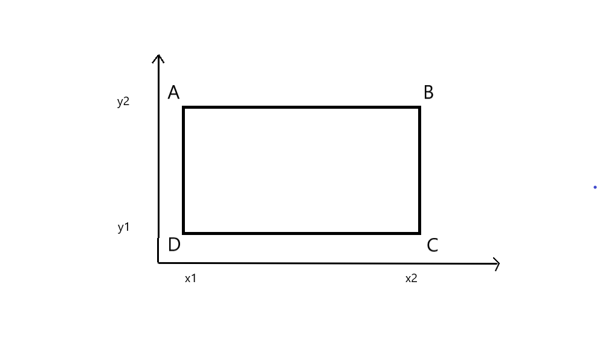

# 1.15 CÁC HÌNH CHỮ NHẬT

**Time limit:** 1s.

**Problem:**

*Trên mặt phẳng toạ độ N hình chữ nhật (HCN) có diện tích khác 0 và có các cạnh song song với các trục toạ độ. Mỗi HCN được mô tả bằng 4 số nguyên ($x_1, y_1$) và ($x_2, y_2$) biểu thị toạ độ nguyên của hai đỉnh đối diện.*

*Yêu cầu:* Xác định diện tích phần mặt phẳng bị các hình chữ nhật phủ.

Dữ liệu vào: tệp văn bản **HCN.INP** :

- Dòng 1: số tự nhiên 1 < N $\leq$ 1000.
- Dòng thứ i trong N dòng tiếp theo, mỗi dòng chứa 4 số nguyên $x_1, y_1, x_2, y_2$ cách nhau qua dấu cách.

Dữ liệu ra: tệp văn bản **HCN.OUT** chứa tổng đơn vị diện tích trên mặt phẳng bị các hình chữ nhật phủ.

*Ví dụ:*

|HCN.INP|HCN.OUT|
|:----|:---|
|5|35|
|0 0 2 4|
|1 2 4 6|
|5 3 3 7|
|4 1 6 5|
|7 3 9 0|

## Thuật toán

*Phương pháp:* Tham:

#