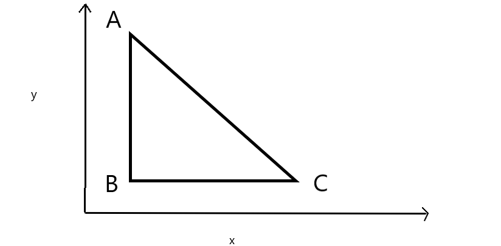

# 1.16 CÁC TAM GIÁC VUÔNG CÂN

**Time limit:** 1s.

**Problem:**

*Trên mặt phẳng toạ độ cho N tam giác vuông cân, hai cạnh góc vuông song song với hai trục toạ độ, cạch huyền nằm ở bên phải tam giác. Cụ thể là nếu kí hiệu tam giác ABC là đỉnh góc vuông, cạnh góc vuông AB song song với trục hoành Ox, cạnh góc vuông AC song song với trục trung Oy, AB = AC = d. Mỗi tam giác được mô tả bằng bộ bao số nguyên x, y, d trong đó (x,y) là toạ độ nguyên của đỉnh A, d là chiều dài cạnh góc vuông.

*Yêu cầu:* Tính diện tích do các tam giác phủ trên mặt phẳng toạ độ.

Dữ liệu vào: text file **TAMGIAC.INP** :
- Dòng 1: số tự nhiên N trong khoảng 2...1000.
- N dòng tiếp theo: mỗi dòng 3 số x, y, d cách nhau qua dấu cách, x và y biến thiên trong khoảng (-1000, 1000), d trong khoảng 1...1000.

Dữ liệu ra: text file **TAMGIAC.OUT** chứa một số thực duy nhất S - diện tích bị các tam giác phủ trên mặt phẳng toạ độ.

*Ví dụ:*

|TAMGIAC.INP|TAMGIAC.OUT|
|:----|:---|
|5| 16.50|
|6 0 3|
|1 0 3|
|2 1 3|
|4 1 2|
|4 5 2|

#