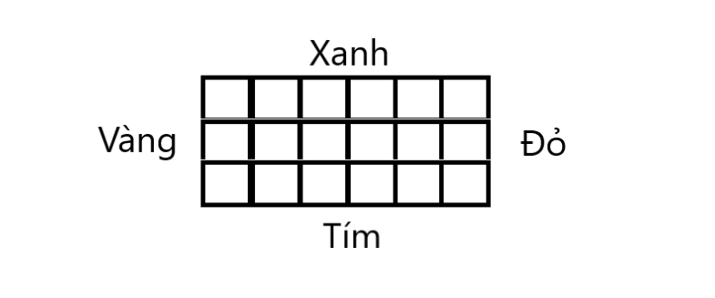

# 1.8 XANH ĐỎ TÍM VÀNG 1

**Time limit:** 1s.

**Problem:**

*Cho 4 loại đoạn thẳng sơn các màu xanh, đỏ, tím, vàng, bao gồm x đoạn màu xanh mỗi đoạn dài dx, d đoạn màu đỏ mỗi đoạn dài dd, t đoạn màu tím mỗi đoạn dài dt và v đoạn màu vàng mỗi đoạn dài dv. Các đoạn thẳng cùng màu thì có cùng chiều dài. Hãy chọn mỗi loại một số đoạn thẳng rồi xếp nối nhau theo chu vi để thu được một hình chữ nhất có diện tích lớn nhất với các cạnh lần lượt mang các màu tính theo chiều quay của kim đồng hồ là xanh, đỏ, tím, vàng. Các đại lượng trong bài đều là các số nguyên dương.*

Dữ liệu vào: tệp văn bản **XDTV1.INP** gồm 4 dòng, mỗi dòng có hai số nguyên dương viết cách nhau bằng dấu cách:

- Dòng 1: x dx.
- Dòng 2: d dd.
- Dòng 3: t dt.
- Dòng 4: v dv.

Dữ liệu ra: tệp văn bản **XDTV1.OUT** :

- Dòng 1: Diện tích của hình chữ nhật xanh-đỏ-tím-vàng.
- Dòng 2: 4 số cho biết số lượng đoạn thẳng cần chọn theo mỗi loại màu để ghép được hình chữ nhật có diện tích max.

*Ví dụ:* dưới cho biết cần chọn 15 đoạn xanh, 4 đoạn đỏ, 12 đoạn tím và 3 đoạn vàng để ghép được hình chữ nhất xanh-đỏ-tím-vàng với diện tích max là:

15120 = (15 * 12) * (4 * 21) = (12 * 15) * (3 * 28).

|XDTV1.INP|XDTV1.OUT|
|:---|:---|
|15 12| 15120|
|6 21| 15 4 12 3|
|14 15|
|10 28|

#
