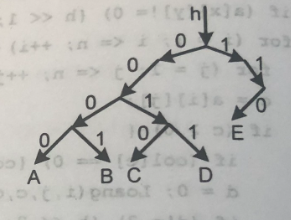

# 4.9 GIẢI MÃ

**Time limit:** 1s.

**Problem:**

*Cho mã nhị phân của n chữ cái đầu bảng chữ tiếng Anh A, B, C,... Biết rằng không có mã nào là khúc đầu của mã khác và chiều dài tối của mỗi mã là 10. Lập chương trình giải mã một văn bản.*

*Input text file:* **code.inp** :

- Dòng 1: số n; 1 $\leq$ n $\leq$ 26.
- N dòng tiếp, mỗi dòng chứa mã nhị phân của một chữ cái theo trật tự A, B, C...
- Dòng cuối chứa mã cần giải.

*Output file:* **code.out** chứa văn bản đã giải.

*Ví dụ:* 

n = 5 kí tự đầu trong bảng chữ cái tiếng Anh là A = 0000, B = 0001, C = 0010, D = 0011, E = 110.

Đoạn mã văn bản cần giải là s = 0000000100010000. Sau khi giải mã ta phải thu được kết quả: **ABBA**.

|code.inp|code.out|
|:----|:---:|
|5|ABBA|
|0000|
|0001|
|0010|
|0011|
|110|
|0000000100010000

#