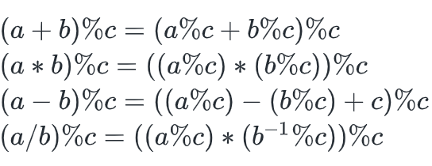
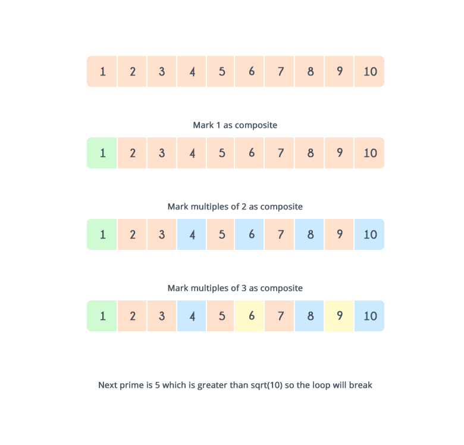

# Introduction
1. Modular arithmetic (Số học)
2. Modular exponentiation (Lũy thừa)
3. Greatest Common Divisor (GCD - Ước số chung lớn nhất)
4. Extended Euclidean algorithm (Thuật toán Euclid mở rộng)
5. Modular multiplicative inverse (Nghịch đảo nhân)
6. Typical problems

# Modular arithmetic

Khi một số chia cho số khác, phép toán modulo tìm ra phần dư. Nó được biểu diễn bằng ký hiệu %.

Ví dụ:
Giả sử bạn có hai số là 5 và 2. Khi 5 chia cho 2, kết quả của phép toán modulo là 1, vì phần dư khi 5 chia cho 2 là 1.

Phép toán mở rộng:



Ví dụ:
Cho $a = 10^{18}$, $b = 10^{18}$, $c = 10^{9}+7$. Cần tính $(a*b)$%$c$

Khi nhân a và b kết quả sẽ ra $10^{36}$, rất lớn và không thể lưu trữ ở dạng dữ liệu chuẩn mà ngôn ngữ lập trình cung cấp.

Để tránh điều đó xảy ra chúng ta cần xử lý như sau:

`(a*b)%c` = `((a%c)*(b%c))%c`

# Modular exponentiation

Lũy thừa là một phép toán được biểu diễn dưới dạng $x^n = x.x.x.x....x$ ($n$ lần).

## Basic method

Cách cơ bản nhất: $x.x^{n-1}$
```cpp
int recursivePower(int x,int n)
{
    if(n==0)
        return 1;
    return x*recursivePower(x,n-1);
}
```
```cpp
int iterativePower(int x,int n)
{
    int result=1;
    while(n>0)
    {
        result=result*x;
        n--;
    }
    return result;
}
```        

Độ phức tạp: $O(n)$, nếu $n$ rất lớn, thuật toán sẽ không phù hợp.

## Optimized method

Cơ sở của Lũy thừa Nhị phân dựa vào việc $n$ là số lẻ hay chẵn.

Nếu $n$ là chẵn, $x^{n} = (x^2)^{n/2}$, trong đó $x^{2}$ dễ tìm, $x^{n/2}$ thì có thể tìm bằng cách tiếp tục $/2$ nếu vẫn là chẵn.

Nếu $n$ là lẻ, cần chuyển về chẵn. $x^n = x.x^{n-1}$, $x^{n-1}$ với $n-1$ là chẵn.

Recursive version

```cpp
int binaryExponentiation(int x,int n)
{
    if(n==0)
        return 1;
    else if(n%2 == 0)        //n is even
        return binaryExponentiation(x*x,n/2);
    else                             //n is odd
        return x*binaryExponentiation(x*x,(n-1)/2);
}
```

Iterative version

```cpp
int binaryExponentiation(int x,int n)
{
    int result=1;
    while(n>0)
    {
        if(n % 2 ==1)
            result=result * x;
        x=x*x;
        n=n/2;
    }
    return result;
}
```

Vấn đề  đầu ra rất lớn: Thuật toán có thể vẫn được chạy bình thường nhưng đưa ra giá trị rác.

Đề bài có thể ra thêm phần chia dư. Ví dụ như tìm $x^n$%$M$

Recursive version

```cpp
int modularExponentiation(int x,int n,int M)
{
    if(n==0)
        return 1;
    else if(n%2 == 0)        //n is even
        return modularExponentiation((x*x)%M,n/2,M);
    else                             //n is odd
        return (x*modularExponentiation((x*x)%M,(n-1)/2,M))%M;

}
```

Iterative version

```cpp
int modularExponentiation(int x,int n,int M)
{
    int result=1;
    while(n>0)
    {
        if(power % 2 ==1)
            result=(result * x)%M;
        x=(x*x)%M;
        n=n/2;
    }
    return result;
}
```

Đánh giá thuật toán

Recursive solution analysis
- Time complexity: $O(log N)$
- Memory complexity: $O(log N)$ because a function call consumes memory and log N recursive function calls are made

Iterative solution analysis
- Time complexity: $O(log N)$
- Memory complexity: $O(1)$

# Greatest Common Divisor (GCD)

Ước số chung lớn nhất (GCD) của hai hoặc nhiều số là số nguyên dương lớn nhất chia hết cho tất cả các số đó. Ví dụ, GCD của 6 và 10 là 2 vì đây là số nguyên dương lớn nhất có thể chia hết cho cả 6 và 10.

## Naive approach

Duyệt qua tất cả các số từ min(A, B) đến 1 và kiểm tra xem số hiện tại có chia hết cho cả A và B không. Nếu có, đó là ước số chung lớn nhất của A và B.

```cpp
int GCD(int A, int B) {
    int m = min(A, B), gcd;
    for(int i = m; i > 0; --i)
        if(A % i == 0 && B % i == 0) {
            gcd = i;
            return gcd;
        }
}
```
Độ phức tạp: $O(min(A, B))$.

## Euclid's algorithm

`GCD(A,B) = GCD(B,A%B)`, lặp đến khi `A%B=0`.
```cpp
int GCD(int A, int B) {
    if(B==0)
        return A;
    else
        return GCD(B, A % B);
}
```
Độ phức tạp: $O(log(max(A,B)))$.

# Extended Euclidean algorithm

$GCD(A,B)$ luôn có thể biểu diễn dưới dạng phương trình:

$Ax + By = GCD(A,B)$

Các hệ số ($x$ và $y$) của phương trình này sẽ được sử dụng để tìm nghịch đảo nhân modular. Các hệ số có thể là số không, dương hoặc âm.


Thuật toán này nhận hai đầu vào là A và B và trả về
và các hệ số của phương trình trên làm đầu ra.

Implementation

```cpp
#include < iostream >

int d, x, y;
void extendedEuclid(int A, int B) {
    if(B == 0) {
        d = A;
        x = 1;
        y = 0;
    }
    else {
        extendedEuclid(B, A%B);
        int temp = x;
        x = y;
        y = temp - (A/B)*y;
    }
}

int main( ) {
extendedEuclid(16, 10);
cout << ”The GCD of 16 and 10 is ” << d << endl;
cout << ”Coefficients x and y are ”<< x <<  “and  “ << y << endl;
return 0;   
}
```
Độ phức tạp: $O(log(max(A,B)))$.

# Modular multiplicative inverse
...

# Prime
Khái niệm về số nguyên tố là một khái niệm quan trọng trong toán học. 

Số nguyên tố là những số lớn hơn 1 và chỉ có hai ước số là 1 và chính nó.

Số hợp là những số cũng lớn hơn 1, nhưng chúng có ít nhất một ước số khác ngoài 1 và chính nó.

Ví dụ, số 5 là số nguyên tố vì 5 chỉ chia hết cho 1 và 5. Ngược lại, số 6 là số hợp vì 6 chia hết cho 1, 2, 3 và 6.

Có nhiều phương pháp để kiểm tra xem một số có phải là số nguyên tố hay không.

## Naive approach

Duyệt qua tất cả các số từ 1 đến N và đếm số lượng ước số. Nếu số lượng ước số bằng 2 thì số đó là số nguyên tố, ngược lại không phải.

```cpp
void checkprime(int N){
    int count = 0;
    for( int i = 1;i <= N;++i )
        if( N % i == 0 )
            count++;
        if(count == 2)
            cout << N << “ is a prime number.” << endl;
        else
            cout << N << “ is not a prime number.” <<endl;
}
```

Độ phức tạp: $O(N)$.

## Better approach
Nếu bạn có hai số nguyên dương là N và D, sao cho N chia hết cho D và D nhỏ hơn căn bậc hai của N.

- (N/D) phải lớn hơn căn bậc hai của N.
- N cũng chia hết cho (N/D). Nếu có một ước số của N nhỏ hơn căn bậc hai của N, thì cũng sẽ có một ước số của N lớn hơn căn bậc hai của N. Bạn sẽ phải duyệt qua đến căn bậc hai của N.

Lưu ý: Bạn đang tạo ra tất cả các ước số của N và nếu số lượng ước số lớn hơn 2, thì số đó là số hợp.
Ví dụ, nếu N=50, căn bậc hai của N=7 (giá trị làm tròn xuống). Bạn sẽ lặp từ 1 đến 7 và đếm số lượng ước số của N. Các ước số của N là 1, 50; 2, 25; 5, 10. Bạn có 6 ước số của 50, và do đó, đó không phải là số nguyên tố.

```cpp
void checkprime(int N) {
        int count = 0;
        for( int i = 1;i * i <=N;++i ) {
             if( N % i == 0) {
                 if( i * i == N )
                         count++;
                 else       // i < sqrt(N) and (N / i) > sqrt(N)
                         count += 2;
              }
        }
        if(count == 2)
            cout << N << “ is a prime number.” << endl;
        else
            cout << N << “ is not a prime number.” << endl;
    }
```

Recommend

```cpp
bool isPrime(int n) {
    for (int i = 2; i * i <= n; ++i) {
        if (n % i == 0) {
            return false;
        }
    }
    return true;
}
```
Độ phức tạp: $O(\sqrt{N})$.

## Sieve of Eratosthenes


Bạn có thể sử dụng Sàng Eratosthenes để tìm tất cả các số nguyên tố nhỏ hơn hoặc bằng một số N cho trước hoặc để xác định xem một số có phải là số nguyên tố hay không.

Ý tưởng cơ bản đằng sau Sàng Eratosthenes là ở mỗi lần lặp, một số nguyên tố được chọn và tất cả các bội số của nó được loại bỏ. Sau quá trình loại bỏ, tất cả các số chưa đánh dấu còn lại là số nguyên tố.

Mã giả:

- Đánh dấu tất cả các số là số nguyên tố trừ 1.
- Duyệt qua mỗi số nguyên tố nhỏ hơn căn bậc hai của N.
- Đối với mỗi số nguyên tố, đánh dấu tất cả các bội số của nó là số hợp số.
- Các số không phải là bội số của bất kỳ số nào sẽ vẫn được đánh dấu là số nguyên tố và các số khác sẽ được đánh dấu là số hợp số.

```cpp
void sieve(int N) {
        bool isPrime[N+1];
        for(int i = 0; i <= N;++i) {
            isPrime[i] = true;
        }
        isPrime[0] = false;
        isPrime[1] = false;
        for(int i = 2; i * i <= N; ++i) {
             if(isPrime[i] == true) {                    //Mark all the multiples of i as composite numbers
                 for(int j = i * i; j <= N ;j += i)
                     isPrime[j] = false;
            }
        }
    }
```

Mã này sẽ tính toán tất cả các số nguyên tố nhỏ hơn hoặc bằng N.

Hãy tính toán các số nguyên tố khi N = 10.

1. Đánh dấu tất cả các số là số nguyên tố.
2. Đánh dấu 1 là số hợp số.

Trong mỗi lần lặp, kiểm tra xem một số có phải là số nguyên tố hay không, nếu có thì đánh dấu tất cả các bội số của nó là số hợp số.



Số nguyên tố là 2, 3, 5, và 7.


Độ phức tạp thời gian
Vòng lặp nội bộ chạy cho mỗi phần tử như sau:

- Nếu i = 2, vòng lặp nội bộ chạy N / 2 lần
- Nếu i = 3, vòng lặp nội bộ chạy N / 3 lần
- Nếu i = 5, vòng lặp nội bộ chạy N / 5 lần

Độ phức tạp $N * (½ + ⅓ + ⅕ + … ) = O(NloglogN)$

## Modification of Sieve of Eratosthenes for fast factorization

Phân tích thành thừa số trong $\sqrt{N}$

```cpp
vector<int> factorize(int n) {
    vector<int> res;
    for (int i = 2; i * i <= n; ++i) {
        while (n % i == 0) {
            res.push_back(i);
            n /= i;
        }
    }
    if (n != 1) {
        res.push_back(n);
    }
    return res;
}
```

Ví dụ:

$n = 50$, $i = 2$; $res = \{2\}$

$n = 25$, $i = 3$; $res = \{2\}$

$n = 25$, $i = 4$; $res = \{2\}$

$n = 25$, $i = 5$; $res = \{2, 5, 5\}$

$n = 1$


Khi bạn thoát khỏi vòng lặp for, `vector res` sẽ là phân tích thành thừa số của căn bậc hai của $\sqrt{N}$.

Ở mỗi bước, bạn phải tìm số nguyên tố có giá trị nhỏ nhất chia hết cho giá trị hiện tại của i. Đây là ý tưởng chính của sửa đổi này.

Hãy xây dựng một mảng sẽ cung cấp cho chúng ta số nguyên tố này trong thời gian $O(1)$.

```cpp
int minPrime[n + 1];
for (int i = 2; i * i <= n; ++i) {
    if (minPrime[i] == 0) {         //If i is prime
        for (int j = i * i; j <= n; j += i) {
            if (minPrime[j] == 0) {
                minPrime[j] = i;
            }
        }
    }
}
for (int i = 2; i <= n; ++i) {
    if (minPrime[i] == 0) {
        minPrime[i] = i;
    }
}
```

Bây giờ, sử dụng sửa đổi này để phân tích thành thừa số của $N$ với độ phức tạp $O(log(N))$.

```cpp
vector<int> factorize(int n) {
    vector<int> res;
    while (n != 1) {
        res.push_back(minPrime[n]);
        n /= minPrime[n];
    }
    return res;
}
```

Ví dụ:

$n = 50$, $minprime[50] = 2$; $res = \{2\}$

$n = 25$, $minprime[25] = 5$; $res = \{2, 5\}$

$n = 5$, $minprime[5] = 5$; $res = \{2, 5, 5\}$

$n = 1$

Đáp án lưu ở biến `res`.

### Conditions

Để thực hiện được thuật toán trên cần tạo mảng số nguyên có độ dài $N$.

Lưu ý: Phương pháp này hữu ích khi bạn cần phân tích thành thừa số của các số không quá lớn. Không cần thiết phải xây dựng một Sàng Eratosthenes sửa đổi cho mọi vấn đề đòi hỏi phân tích thành thừa số. Hơn nữa, bạn không thể xây dựng nó cho các số lớn như $N = 10^9$ hoặc $10^{12}$. Do đó, đối với những số lớn như vậy, khuyến nghị bạn nên phân tích thành thừa số trong thời gian $O(\sqrt{N})$ thay vì sử dụng phương pháp này.

### Fact

Phân tính $N$ thành thừa số nguyên tố:
$$N = p_1^{q_1} * p_2^{q_2} *... *p_k^{q_k}$$

Trong đó:

$p_1, p_2,..., p_k$ là các thừa số nguyên tố của $N$

$q_1, q_2,..., q_k$ là các lũy thừa tương ứng của các thừa số nguyên tố.

## Sieve of Eratosthenes on the segment

Đôi khi cần tìm số nguyên tố trong đoạn $[L,R]$ thay vì $[1,N]$, trong đó $R$ là một số rất lớn.

Cần tạo mảng số nguyên có độ lớn $(R-L+1)$.

```cpp
bool isPrime[r - l + 1]; //filled by true
for (long long i = 2; i * i <= r; ++i) {
    for (long long j = max(i * i, (l + (i - 1)) / i  * i); j <= r; j += i) {
        isPrime[j - l] = false;
    }
}
for (long long i = max(l, 2); i <= r; ++i) {
    if (isPrime[i - l]) {
        //then i is prime
    }
}
```

Độ phức tạp xấp xỉ $O(\sqrt{R})$

# Typical problems

## Prime

```cpp
bool isPrime(int n) {
    for (int i = 2; i * i <= n; ++i) {
        if (n % i == 0) {
            return false;
        }
    }
    return true;
}
```
Độ phức tạp: $O(\sqrt{N})$.

Sieve of Eratosthenes

Độ phức tạp: $O(NloglogN)$

## Square Number

```cpp
bool checkSquareNum(int x){
	if(sqrt(x)*sqrt(x) == x) return true;
	return false;
}
```
## GCD

Recursive Version
```cpp
int gcd(int a, int b)
{
    return b == 0 ? a : gcd(b, a % b);    
}
```

Iterative Version
```cpp
int gcd(int a, int b)
{
    while (a > 0 && b > 0) {
        if (a > b) {
            a = a % b;
        }
        else {
            b = b % a;
        }
    }
    if (a == 0) {
        return b;
    }
    return a;
}
```

```cpp
// c++ program to find gcd using inbuilt functions
#include <algorithm>
#include <iostream>
using namespace std;
 
int main()
{
    int a = 98, b = 56;
    cout << "The gcd of a and b is " << __gcd(a, b) << endl;
    return 0;
}
```
Độ phức tạp: $O(log(min(a,b)))$

## LCM

```cpp
// Recursive function to return gcd of a and b  
long long gcd(long long int a, long long int b) 
{ 
  if (b == 0) 
    return a; 
  return gcd(b, a % b); 
} 
  
// Function to return LCM of two numbers  
long long lcm(int a, int b) 
{ 
    return (a / gcd(a, b)) * b; 
} 
   
```

Độ phức tạp: $O(log(min(a,b)))$

## Updating...
updating...

# References
- [Basic Number Theory-1](https://www.hackerearth.com/practice/math/number-theory/basic-number-theory-1/tutorial/)
- [Basic Number Theory-2](https://www.hackerearth.com/practice/math/number-theory/basic-number-theory-2/tutorial/)
- [Sieve of Erastothenes](https://en.wikipedia.org/wiki/Sieve_of_Eratosthenes)
- [Number Theory](https://www.geeksforgeeks.org/number-theory-competitive-programming/)